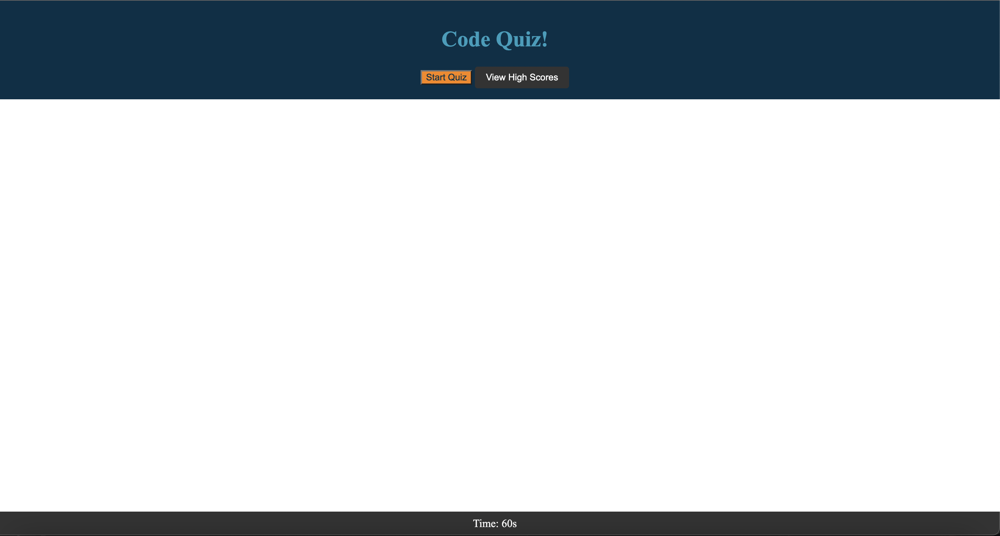
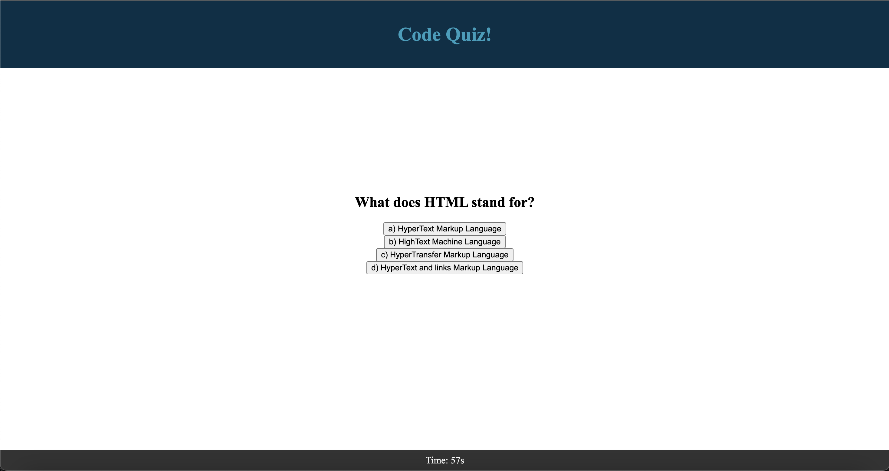
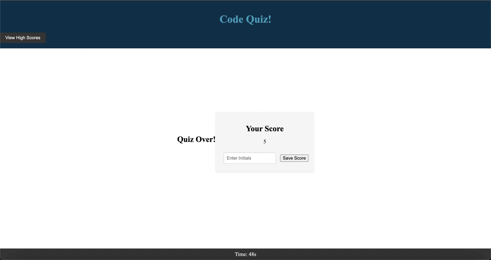

# code-quiz

# Description 
It is a simple quiz created to test ones knowledge on their coding skills.

## Links

<a href="https://saeeda14.github.io/code-quiz/"> Link to Deployed website </a>

<a href="https://github.com/Saeeda14/code-quiz.git"> Link to Repo code </a>

## Screenshot

